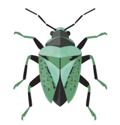

Taxai is a web app that helps to identify species using a machine learning model. Built with Python and PyTorch. Can be run locally with Docker Compose and deployed to prodiction on Google Cloud Run. Works reasonably effectively with CPU. Work in progress, first demo version deployed publicly on 2025-03-22.

# Setup (untested)

- Clone this repository.
- Create a directory for the model:

    mkdir ./app/model_store

- Put model to model_store directory. 
- Add model name and settings to /.api/app.py
- Start with:

    docker compose up --build; docker compose down;

App will be available at http://localhost:8080/

API health check endpoint will be available at http://localhost:8080/health

# Deploy to Google Cloud Run

    gcloud run deploy taxai --project=havistin --image=gcr.io/havistin/taxai --max-instances=1 --concurrency=5 --memory=2048Mi --timeout=40

Adjust options if needed:

    gcloud run services update taxai --min-instances=1

# Usage

When calling the API you must provide an image. Region and date are optional.

    json_request = {
        'image': img_data,
    }

# Notes

Issue when building this:
- Tried to install full pytorch with GPU, which was very slow. Use CPU version instead.
-  Compatibility issues with CPU library versions.
- Called API from within Docker with localhost, which doesn't work. Use container name instead.
- If Numpy version is too recent, PyTorch says Numpy is not available. Need to use version 1.26.4.

Current AI model (20250319_0038_species_id_min_30_efficientnet_b5_epoch_38.pth) is not good with
- Corixidae
- Phytocoris

Possible terms:

- Almost certain / Melkein varma (0.99 - 1.0)
- Likely / Todennäköinen (0.95 - 0.99)
- Possible / Mahdollinen (0.85 - 0.95)
- Uncertain / Epävarma (0.7 - 0.85)
- Just a guess / Pelkkä arvaus (0.5 - 0.7)
- Cannot identify / En osaa tunnistaa (0 - 0.5)

# Todo: Cleanup

.dockerignore
model
.env

